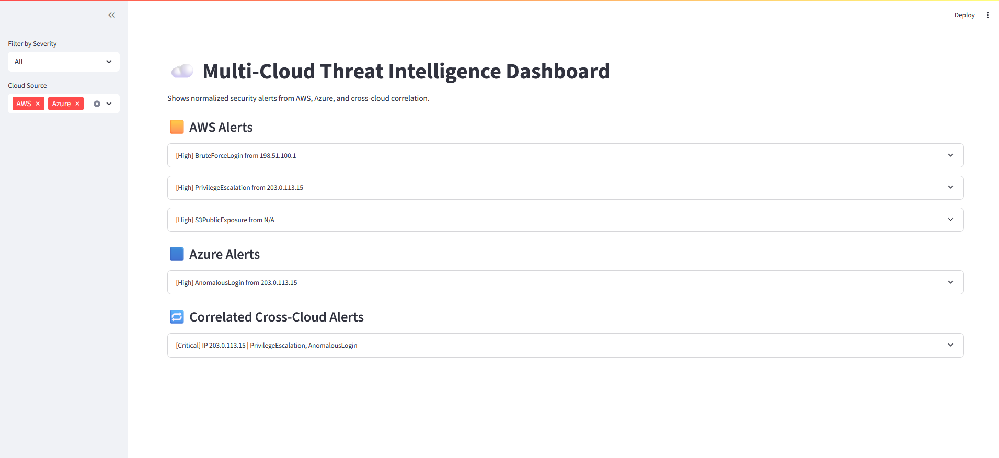

# ☁️ Multi-Cloud Threat Intelligence Dashboard

Correlate and visualize AWS + Azure security events with a cross-cloud security monitoring dashboard built using Python and Streamlit.

---

## 🔍 Overview

This dashboard aggregates and correlates security alerts from AWS CloudTrail and Azure Sign-In logs. It normalizes the data, identifies cross-cloud threats (e.g., shared malicious IPs), and presents them in an interactive Streamlit interface.

---

## 🛠️ Key Features

- ✅ Parses and normalizes AWS + Azure security events  
- ✅ Correlates alerts by source IP for unified threat intelligence  
- ✅ Interactive dashboard with severity and cloud-provider filters  
- ✅ Built with Python, Streamlit, and modular JSON data pipelines  

---

## 🧰 Tech Stack

- **Languages**: Python  
- **Cloud Providers**: AWS, Azure  
- **Framework**: Streamlit  
- **Data Format**: JSON  

---

## 📁 Project Structure

```
multi_cloud_threat_intelligence_dashboard/
│
├── aws/
│   ├── cloudtrail_bruteforce.json
│   ├── cloudtrail_escalation.json
│   ├── guardduty_s3_public.json
│   ├── lambda_parser.py
│   └── aws_alerts_parsed.json
│
├── azure/
│   ├── aad_signin_logs.json
│   ├── function_parser.py
│   └── azure_alerts_parsed.json
│
├── correlation_engine/
│   ├── correlate_alerts.py
│   └── correlated_alerts.json
│
├── app.py
└── README.md
```

---

## 🚀 How to Run

> Make sure Streamlit is installed. If not, run:

```bash
pip install streamlit
```

Then start the dashboard:

```bash
streamlit run app.py
```

---

## 📸 Screenshot



---

## 🧠 Future Enhancements

- Integrate real-time log ingestion (e.g., from S3 buckets or Azure blob storage)  
- Add alert severity scoring  
- Build alert timelines and maps  

---

## 📌 Author

Built by Adam Mukdad  
[GitHub Profile](https://github.com/adammukdad)
